# **DAY 1: THE PHYSICS OF DATA — LINUX KERNEL & I/O**

## **1.0 THE ARCHITECTURE OF CONTROL**

### **1.1 The Privilege Hierarchy**

Modern computing systems enforce a strict separation between **application code** and **hardware access**. This separation is implemented through CPU **privilege rings**:
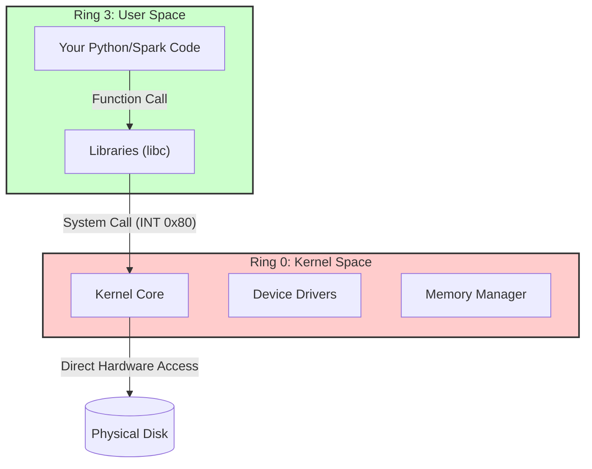

**Key Implications**:

1. **Isolation**: Each user-space process operates in a virtualized environment.
2. **Security**: Malicious code cannot directly manipulate hardware.
3. **Stability**: Kernel crashes require system reboot, process crashes are contained.
4. **Performance**: Mode switches between rings incur measurable overhead.

### **1.2 The System Call Mechanism**

When a user-space application needs hardware resources, it must invoke a **system call**. The Linux kernel exposes approximately 400 system calls, categorized as:

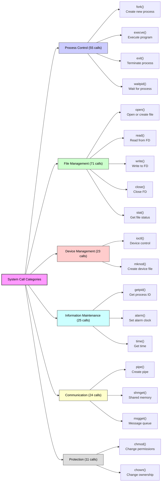

**System Call Execution Flow**:

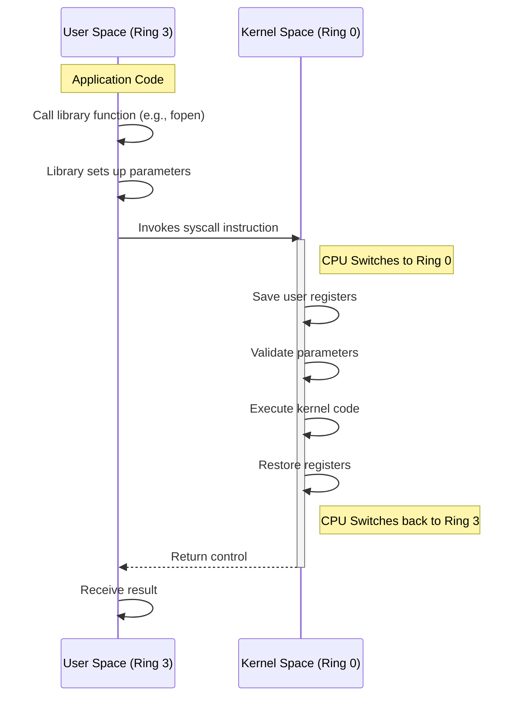

### **1.3 Context Switch Overhead**

The transition between user space and kernel space involves significant CPU overhead:

```mermaid
gantt
    title Context Switch Timeline (Nanoseconds)
    dateFormat X
    axisFormat %s
    
    section User Mode
    App Running           : 0, 100
    Trigger Syscall       : 100, 150

    section Context Overhead
    Save Registers (SSE/AVX) : 150, 300
    Switch Kernel Stack   : 300, 400

    section Kernel Mode
    Validate Parameters   : 400, 600
    Execute Handler       : 600, 800

    section Context Overhead
    Prepare Return        : 800, 950
    Restore CPU State     : 950, 1000

```

**Quantifying the Cost**:

```bash
# Measure context switch overhead
$ perf stat -e cs bash -c 'for i in {1..10000}; do : ; done'

# Typical results:
# 10,000 context switches
# 0.5-1.0 microseconds each
# 5-10 milliseconds total overhead

```

**Real-World Impact**: A Spark job reading 1 million small files incurs:

* 1,000,000 × 0.75µs = 750ms **just in context switch overhead**
* Plus actual I/O time (seeks, transfers)
* Plus scheduling overhead

---

## **2.0 FILE SYSTEM FUNDAMENTALS**

### **2.1 The Virtual File System (VFS) Layer**

The VFS provides a uniform interface to multiple filesystem types:

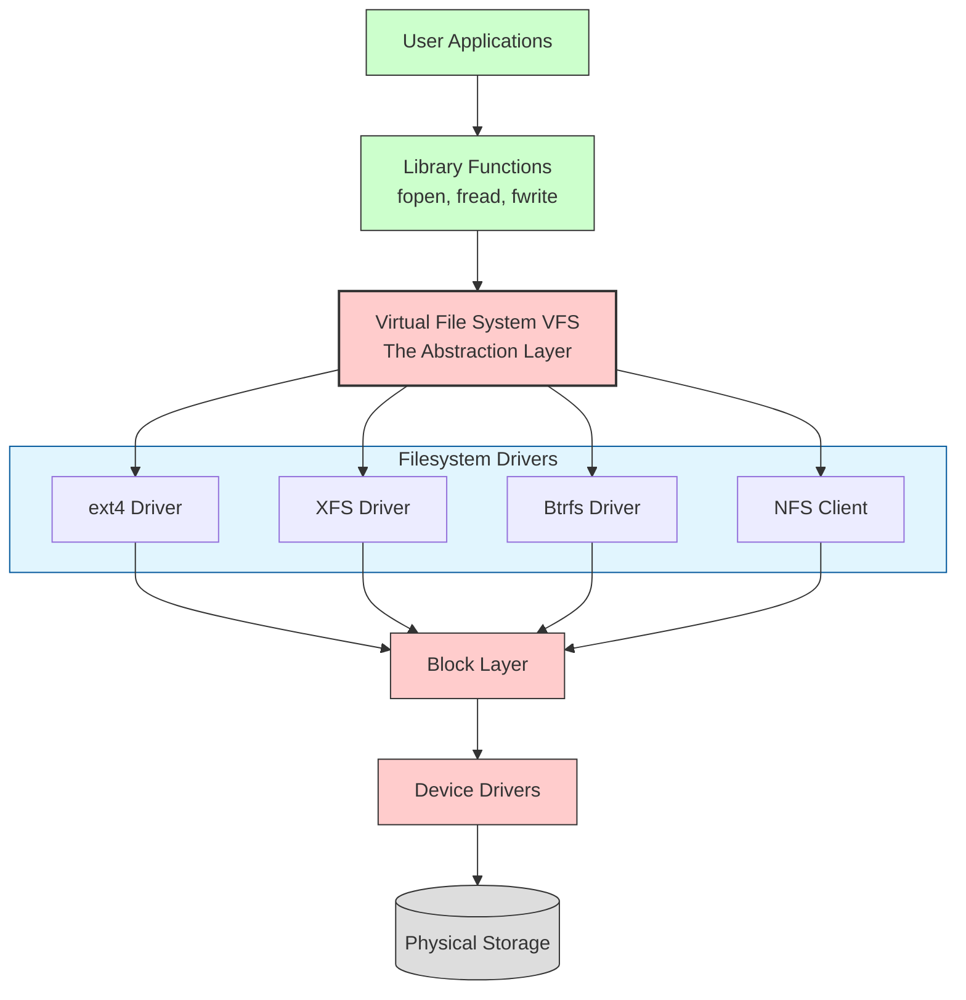

**VFS Key Data Structures**:

1. **superblock**: Filesystem metadata
2. **inode**: File metadata
3. **dentry**: Directory entry (name → inode mapping)
4. **file**: Open file instance
5. **address_space**: Page cache mapping

### **2.2 Inode: The File's Metadata Container**

An inode (index node) contains all file metadata except the filename:

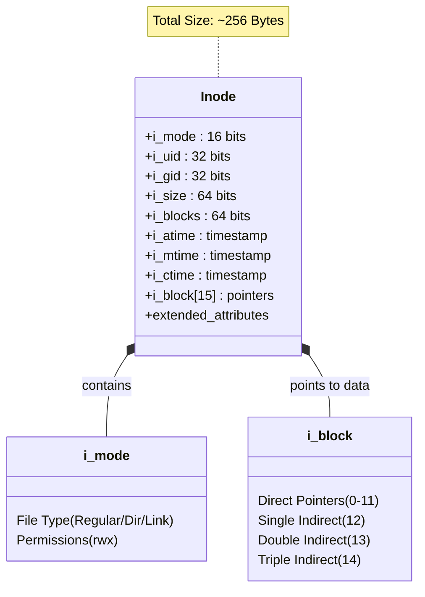

**Inode Pointer Structure**:

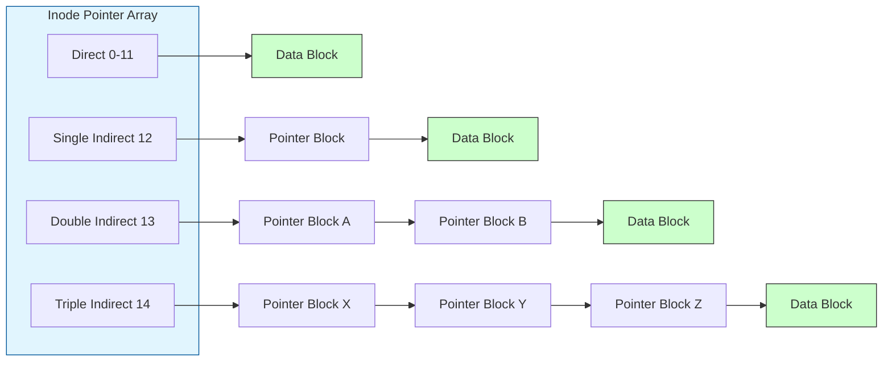

**Maximum File Size Calculation** (4KB blocks, 32-bit block numbers):

* Direct blocks: 12 × 4KB = **48KB**
* Single indirect: 1K pointers × 4KB = **4MB**
* Double indirect: 1K × 1K × 4KB = **4GB**
* Triple indirect: 1K × 1K × 1K × 4KB = **4TB**
* **Total: ~4TB** (theoretical maximum)

### **2.3 Directory Structure**

Directories are special files containing name → inode mappings:

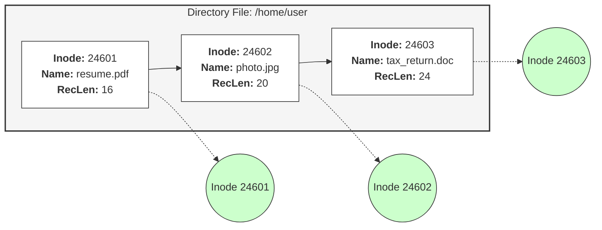

**Pathname Resolution**:

```bash
# What happens when you access /home/user/file.txt:
1. Start at root inode (always 2)
2. Read directory entries for "home" → inode 12345
3. Read inode 12345 (directory), find "user" → inode 67890
4. Read inode 67890, find "file.txt" → inode 54321
5. Read inode 54321's data blocks

# This is why deep directory trees are slower to traverse

```

---

## **3.0 FILE DESCRIPTORS AND I/O MANAGEMENT**

### **3.1 The File Descriptor Hierarchy**

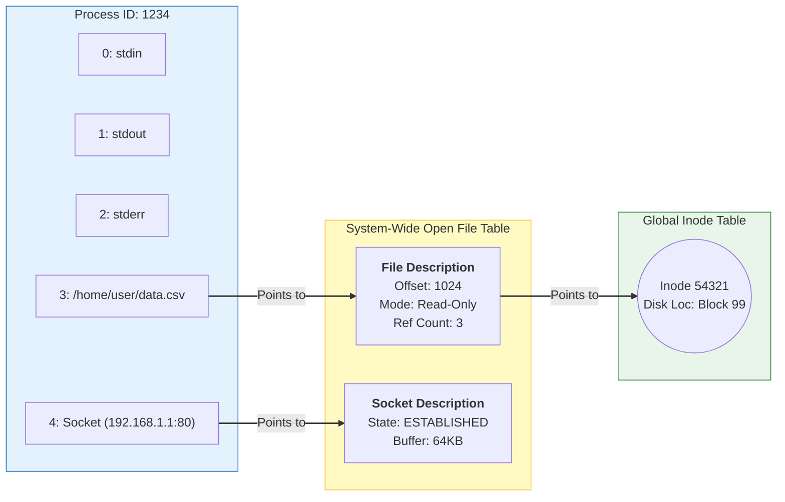

### **3.2 File Descriptor Limits**

**Process Limits**:

```bash
# Check current limits
$ ulimit -n
1024  # Default soft limit

$ ulimit -Hn
4096  # Hard limit (cannot exceed without root)

# View all limits
$ ulimit -a
core file size          (blocks, -c) 0
data seg size           (kbytes, -d) unlimited
scheduling priority             (-e) 0
file size               (blocks, -f) unlimited
pending signals                 (-i) 30907
max locked memory       (kbytes, -l) 64
max memory size         (kbytes, -m) unlimited
open files                      (-n) 1024
pipe size            (512 bytes, -p) 8
POSIX message queues     (bytes, -q) 819200
real-time priority              (-r) 0
stack size              (kbytes, -s) 8192
cpu time               (seconds, -t) unlimited
max user processes              (-u) 30907
virtual memory          (kbytes, -v) unlimited
file locks                      (-x) unlimited

```

**System-Wide Limits**:

```bash
# Maximum filesystem-wide open files
$ cat /proc/sys/fs/file-max
3253168

# Current allocation
$ cat /proc/sys/fs/file-nr
1056    0       3253168
# ↑       ↑        ↑
# Alloc    Free     Max

```

### **3.3 Memory-Mapped Files**

**Traditional I/O vs Memory-Mapped I/O**:

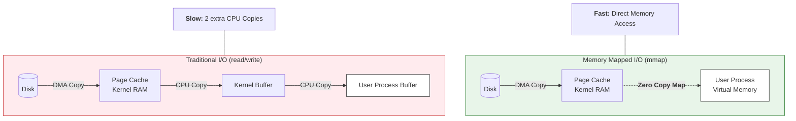

**Benefits**:

1. **Zero-copy** for cache hits
2. **Efficient random access** (no seeking)
3. **Shared memory** between processes
4. **Lazy loading** (pages loaded on demand)

---

## **4.0 THE SMALL FILE PROBLEM**

### **4.1 Quantifying the Overhead**

Consider 1 million files, each 1KB:

````mermaid
graph TD
    subgraph Traditional ["Traditional I/O (read/write)"]
        style Traditional fill:#ffebee,stroke:#c62828
        Disk1[(Disk)]
        PageCache1["Page Cache<br/>Kernel RAM"]
        KernelBuf[Kernel Buffer]
        UserBuf[User Process Buffer]

        Disk1 -->|DMA Copy| PageCache1
        PageCache1 -->|CPU Copy| KernelBuf
        KernelBuf -->|CPU Copy| UserBuf
    end

    subgraph Mmap ["Memory Mapped I/O (mmap)"]
        style Mmap fill:#e8f5e9,stroke:#2e7d32
        Disk2[(Disk)]
        PageCache2["Page Cache<br/>Kernel RAM"]
        ProcessSpace["User Process<br/>Virtual Memory"]

        Disk2 -->|DMA Copy| PageCache2
        PageCache2 -.->|"<b>Zero Copy Map</b>"| ProcessSpace
    end

    %% Notes explaining the difference
    Note1["<b>Slow:</b> 2 extra CPU Copies"] --- Traditional
    Note2["<b>Fast:</b> Direct Memory Access"] --- Mmap

    %% Styling
    style UserBuf fill:#fff,stroke:#333
    style ProcessSpace fill:#fff,stroke:#333
````

### **4.2 HDFS Parallel Architecture**

Hadoop HDFS faces identical challenges at petabyte scale:

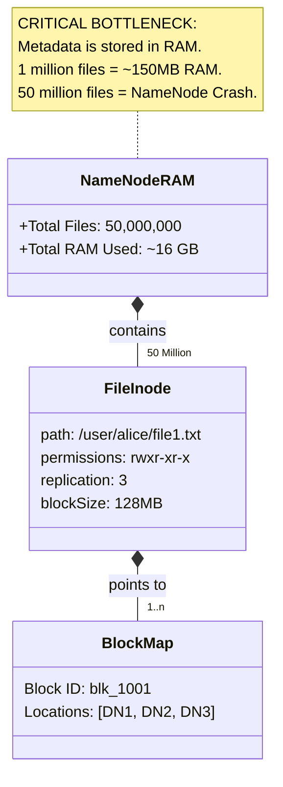

**The Small File Problem in HDFS**:

1. **Memory pressure**: Namenode stores all metadata in RAM.
2. **Startup time**: Loading 50M files takes minutes.
3. **RPC overhead**: Each file operation requires Namenode communication.
4. **Block underutilization**: Small files waste HDFS block capacity (128MB default).

### **4.3 Solutions and Best Practices**

**Solution 1: Archive Files**:

```bash
# Create Hadoop Archive (HAR)
hadoop archive -archiveName data.har -p /input /output

# Structure:
data.har/
├── _index       # Master index (inode table equivalent)
├── _masterindex # Block locations
└── part-* # Data files (multiple files concatenated)

```

**Solution 2: Columnar File Formats (Parquet)**:
**Benefits**:

1. **Single file** = single inode, single open operation.
2. **Column pruning**: Read only needed columns.
3. **Predicate pushdown**: Skip row groups using statistics.

**Solution 3: Application-Level Batching**:

```python
# Anti-pattern: Write each record immediately
for record in stream:
    write_to_hdfs(record)  # 1 file per record

# Best practice: Batch writes
BUFFER_SIZE = 10000
buffer = []

for record in stream:
    buffer.append(record)
    if len(buffer) >= BUFFER_SIZE:
        # Write batch as single file
        write_batch(buffer)
        buffer.clear()

```

---

## **5.0 MONITORING AND DIAGNOSTICS**

### **5.1 Essential Monitoring Commands**

**Inode Usage**:

```bash
# Check filesystem inode usage (CRITICAL!)
$ df -i
Filesystem      Inodes  IUsed   IFree IUse% Mounted on
/dev/sda1      6553600 124356 6429244    2% /
/dev/sdb1     13107200 54321  13052879   0% /data

```

**File Descriptor Monitoring**:

```bash
# Check process FD usage
$ ls -l /proc/$$/fd | wc -l
25  # Current shell's open FDs

# Monitor FD limits
$ watch -n 1 'cat /proc/sys/fs/file-nr'

```

**I/O Performance Analysis**:

```bash
# System call tracing
$ strace -c -e trace=file ls -l
% time     seconds  usecs/call     calls     errors syscall
------ ----------- ----------- --------- --------- ----------------
 45.67    0.000446           7        64           openat
 28.69    0.000280           7        40           close
 12.70    0.000124           6        20           read

```

### **5.2 Kernel Tuning Parameters**

```bash
# Increase system-wide FD limit
echo "fs.file-max = 1000000" >> /etc/sysctl.conf
sysctl -p

# Increase process FD limits
echo "* soft nofile 65535" >> /etc/security/limits.conf
echo "* hard nofile 65535" >> /etc/security/limits.conf

```

---

## **6.0 PRACTICAL EXERCISES**

### **Exercise 1: Inode Exhaustion Simulation**

```bash
#!/bin/bash
# inode_exhaustion.sh
# Demonstrates filesystem can be "full" with empty space

FS="/tmp/test_fs"
MOUNT="$FS/mnt"
DATA="$FS/data"

# Create filesystem with limited inodes
mkdir -p $MOUNT $DATA
dd if=/dev/zero of=$FS/disk.img bs=1M count=100
mkfs.ext4 -N 1000 $FS/disk.img  # Only 1000 inodes!
mount -o loop $FS/disk.img $MOUNT

echo "=== Starting Inode Exhaustion Test ==="
echo "Disk size: 100MB"
echo "Inode count: 1000"
echo ""

# Fill with empty files
for i in {1..2000}; do
    touch $MOUNT/file_$i 2>/dev/null
    if [ $? -ne 0 ]; then
        echo "Failed at file $i (inodes exhausted)"
        break
    fi
done

echo ""
df -h $MOUNT    # Shows plenty of space
df -i $MOUNT    # Shows 100% inode usage

# Cleanup
umount $MOUNT
rm -rf $FS

```

### **Exercise 2: File Descriptor Leak Detection**

```python
#!/usr/bin/env python3
# fd_leak_detector.py
import os
import psutil
import time

def create_fd_leak():
    """Demonstrate FD leak pattern"""
    fds = []
    print("Creating FD leak...")
    
    for i in range(1500):  # More than default 1024 limit
        try:
            # Open file but don't close it
            f = open(f"/tmp/leak_{i}.txt", "w")
            f.write(f"Data {i}")
            fds.append(f)  # Keep reference to prevent GC
            
            if i % 100 == 0:
                pid = os.getpid()
                proc = psutil.Process(pid)
                print(f"Created {i} files, {proc.num_fds()} FDs open")
        except OSError as e:
            print(f"Failed at {i}: {e}")
            break
    
    return fds

def monitor_fds(pid):
    """Monitor FD count for process"""
    proc = psutil.Process(pid)
    
    print(f"\nMonitoring PID {pid}")
    print("Time | Open FDs | FD Limit")
    print("-" * 30)
    
    for _ in range(10):
        fds = proc.num_fds()
        limits = proc.rlimit(psutil.RLIMIT_NOFILE)
        print(f"{time.strftime('%H:%M:%S')} | {fds:8} | {limits[0]:8}")
        time.sleep(1)

if __name__ == "__main__":
    # Check current limits
    soft, hard = psutil.Process().rlimit(psutil.RLIMIT_NOFILE)
    print(f"Current FD limits: soft={soft}, hard={hard}")
    
    # Create leak
    leaked_files = create_fd_leak()
    
    # Monitor
    monitor_fds(os.getpid())
    
    # Cleanup (finally close files)
    print("\nCleaning up...")
    for f in leaked_files:
        f.close()
    print("Done")

```

### **Exercise 3: Performance Benchmark - read() vs mmap()**

```python
#!/usr/bin/env python3
# io_benchmark.py
import mmap
import os
import random
import time
import statistics

def create_test_file(size_gb=1):
    """Create test file with random data"""
    filename = f"/tmp/test_{size_gb}gb.bin"
    if os.path.exists(filename):
        return filename
    
    print(f"Creating {size_gb}GB test file...")
    with open(filename, "wb") as f:
        # Write in chunks to avoid memory issues
        chunk_size = 1024 * 1024  # 1MB
        for _ in range(size_gb * 1024):
            f.write(os.urandom(chunk_size))
    
    return filename

def benchmark_read(filename, num_accesses=10000):
    """Benchmark traditional read operations"""
    file_size = os.path.getsize(filename)
    
    with open(filename, "rb") as f:
        start = time.time()
        for _ in range(num_accesses):
            # Random access
            offset = random.randint(0, file_size - 4096)
            f.seek(offset)
            data = f.read(4096)  # Read 4KB
            _ = len(data)
        elapsed = time.time() - start
    
    return elapsed

def benchmark_mmap(filename, num_accesses=10000):
    """Benchmark memory-mapped access"""
    file_size = os.path.getsize(filename)
    
    with open(filename, "rb") as f:
        mm = mmap.mmap(f.fileno(), 0, access=mmap.ACCESS_READ)
        start = time.time()
        for _ in range(num_accesses):
            offset = random.randint(0, file_size - 4096)
            data = mm[offset:offset+4096]
            _ = len(data)
        elapsed = time.time() - start
        mm.close()
    
    return elapsed

if __name__ == "__main__":
    # Create test file
    test_file = create_test_file(size_gb=1)  # 1GB file
    
    print("\n=== Random Access Benchmark ===")
    print("Accessing 10,000 random 4KB blocks...")
    
    # Warm up cache
    benchmark_read(test_file, 1000)
    
    # Run benchmarks
    read_times = []
    mmap_times = []
    
    for _ in range(5):
        read_times.append(benchmark_read(test_file, 10000))
        mmap_times.append(benchmark_mmap(test_file, 10000))
    
    print(f"Traditional read: {statistics.mean(read_times):.2f}s ")
    print(f"Memory-mapped:    {statistics.mean(mmap_times):.2f}s ")

```

---

## **7.0 SUMMARY: CORE PRINCIPLES**

### **7.1 Key Takeaways**

1. **User Space vs Kernel Space**: Applications run in restricted environments; all hardware access requires kernel mediation via system calls.
2. **Context Switch Overhead**: Each transition between user and kernel mode incurs ~0.5-1.0µs overhead. Scale this by millions of operations for significant impact.
3. **Inodes Are Metadata Containers**: Files are identified by inode numbers, not names. Directories map names to inodes. Inodes store all file metadata and data block pointers.
4. **File Descriptors Are Process Handles**: Each process has a private FD table pointing to system-wide file descriptions. FD limits (default 1024) can break applications.
5. **Memory-Mapped Files Bypass System Calls**: Mapping files into process address space allows zero-copy access via page faults, ideal for random access patterns.
6. **Small Files Are Expensive**: Each file requires an inode, directory entry, and often wastes block space. Columnar formats (Parquet/ORC) solve this by batching.

### **7.2 The Evolution to Distributed Systems**

The principles established in Linux filesystems directly influenced distributed storage systems:

| Linux Concept | HDFS Equivalent | Purpose |
| --- | --- | --- |
| Inode | Namenode Metadata | File metadata storage |
| Block (4KB-64KB) | HDFS Block (128MB+) | Unit of storage |
| Page Cache | HDFS Caching | Data caching layer |
| VFS | HDFS Client | Uniform access interface |
| File Descriptor | HDFS File Handle | Resource handle |