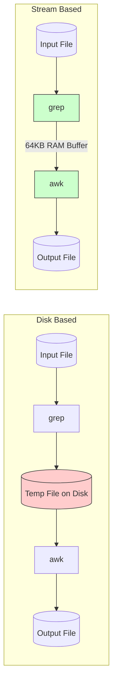
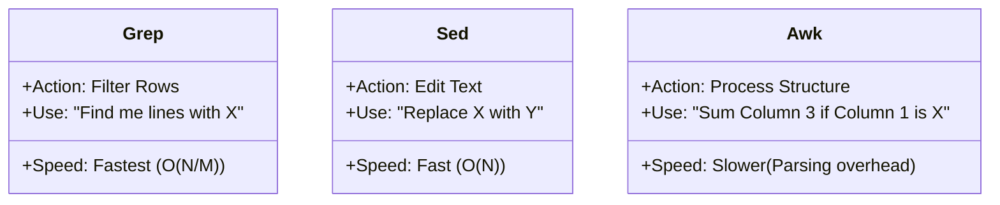
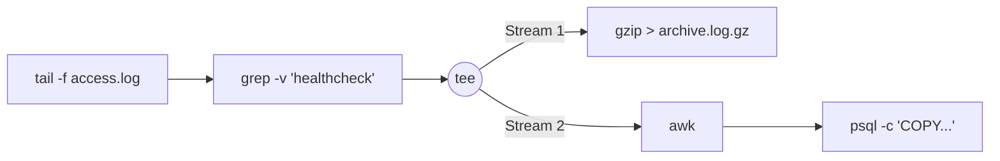

# DAY 2: ADVANCED SHELL & STREAM PROCESSING

## 1.0 THE PHILOSOPHY OF DATA PIPELINES

### 1.1 The Unix Philosophy & The Physics of Pipes

The Unix philosophy serves as the foundation for modern data engineering and microservices. It emphasizes building small, focused tools that communicate via text streams. This allows for **composability**, where complex data processing engines can be built on the fly by connecting simple commands.

#### The "Bucket Brigade" Analogy:

Imagine you need to move water (data) from a lake (Disk) to a tank (Output) and filter it along the way.

- **Disk-Based Approach (Intermediate Files)**: You fill a bucket, walk to the filter, dump it, wait for it to filter into a second bucket, pick up the second bucket, and walk to the tank. This is discrete and involves stopping to "write" (dump bucket) and "read" (fill bucket) repeatedly.
- **Stream-Based Approach (Pipes)**: You connect a hose from the lake to the filter, and another from the filter to the tank. The water flows continuously. The pump (Producer) pushes water exactly as fast as the filter (Consumer) can handle it.

#### The Engineering Physics:

When you run `App A | App B`, the Operating System manages the flow using specific kernel structures:

1. **Kernel Buffer**: The OS allocates a fixed-size ring buffer (typically 64KB) in RAM to act as the connector.
2. **Producer (App A)**: Writes its output directly to this RAM buffer. If the buffer fills up (e.g., App A is faster than App B), the OS **pauses** App A (puts the process to sleep) to prevent overflow. This is called **Backpressure**.
3. **Consumer (App B)**: Reads from this RAM buffer. If the buffer is empty, the OS pauses App B until more data arrives.
4. **Efficiency**: The OS manages these pauses efficiently. Crucially, the data often stays in the **CPU L1/L2 Cache** (hot memory), often avoiding slower main RAM access entirely if the processing is tight.

#### Code Example:

```bash
# DISK-BASED (High I/O Overhead):
# 1. Read huge log -> Write huge temp file (Slow)
grep "ERROR" large.log > temp.txt
# 2. Read huge temp file -> Write output (Slow)
awk '{print $5}' temp.txt > out.txt

# STREAM-BASED (Memory Only):
# grep writes to RAM buffer -> awk reads from RAM buffer.
# The disk is touched only once to read the source and once to write the final result.
grep "ERROR" large.log | awk '{print $5}' > out.txt
```

### 1.2 Visualizing the Pipeline



## 2.0 CORE UNIX TOOLS MASTERY

### 2.1 The Filter Trinity: grep, sed, awk

These three tools are the standard kit for text processing. Understanding their internal mechanics helps in choosing the most efficient tool for the job.

#### 1. grep (Global Regular Expression Print)
- **Role**: The Filter. It selects lines that match a pattern and discards the rest.
- **Internal Engine**: Uses highly optimized C code (often utilizing the **Boyer-Moore** string search algorithm). It can skip ahead in the text, checking fewer characters than exist in the file.
- **Best For**: Quickly finding specific rows.
- **Avoid For**: Editing text or performing calculations.

#### 2. sed (Stream Editor)
- **Role**: The Editor. It performs transformations on text streams.
- **Internal Engine**: Line-oriented. It loads one line into a "pattern space," applies a list of commands (substitute, delete, print), outputs the result, and discards the line. It **never** buffers the whole file.
- **Best For**: Simple text substitutions (`s/old/new/`), deleting specific lines (`1d`), or extracting sections.
- **Limitation**: It treats text as simple characters; it doesn't natively understand "columns" or math.

#### 3. awk (Aho, Weinberger, and Kernighan)
- **Role**: The Processor. It treats text as structured data (rows and columns).
- **Internal Engine**: An interpreted programming language. It automatically splits every line into fields (`$1`, `$2`, etc.) based on a delimiter (space, comma).
- **Best For**: Extracting specific columns, aggregating numbers (`sum += $3`), and formatting output.
- **Cost**: Slower than grep because it pays the CPU penalty of parsing and splitting every single line, even if you don't use all the fields.

#### Performance Note:
If your goal is simply to find lines containing "ERROR", grep is significantly faster than awk. awk has to split the line into fields (`$1`, `$2`...) before checking the condition, whereas grep just scans the raw bytes.

### 2.2 Visual Comparison



## 3.0 ADVANCED STREAM PROCESSING

### 3.1 Process Substitution (`<()`)

Sometimes a tool requires a **file path** as an argument (e.g., `diff file1 file2`), but your data is coming from a command (a stream). You want to avoid creating temporary files on disk.

#### The Solution:
Process Substitution tricks the tool by creating a temporary "Named Pipe" (like a file path) that streams data on demand.

#### Scenario:
Comparing the file lists of two directories without saving them to text files first.

```bash
# The "File" Approach:
ls -R dir1 > list1.txt
ls -R dir2 > list2.txt
diff list1.txt list2.txt
rm list1.txt list2.txt  # Cleanup required

# The Process Substitution Approach:
# The shell runs the commands and connects their outputs to temporary pipes.
# 'diff' reads from these pipes as if they were files.
diff <(ls -R dir1) <(ls -R dir2)
```

#### What happens underneath:
1. Bash executes `ls -R dir1` and sends its output to a pipe (e.g., file descriptor 63).
2. Bash executes `ls -R dir2` and sends its output to another pipe (e.g., file descriptor 64).
3. Bash runs `diff /dev/fd/63 /dev/fd/64`.
4. diff reads the data from these descriptors essentially purely from RAM.

### 3.2 Named Pipes (FIFOs)

A standard pipe `|` connects a parent process to its child. A **Named Pipe** is a special file on the filesystem that acts as a persistent tunnel between **any** two processes, even if they are unrelated.

#### The Mechanics:
It appears as a file in `ls` (marked with `p`), but it occupies **0 bytes** on the disk. Data written to it is held in kernel memory until a reader consumes it.

#### Example: Decoupling Processes
One process generates data (Producer), and another consumes it (Consumer). A Named Pipe allows them to start independently.

```bash
# 1. Create the pipe
mkfifo /tmp/data_pipe

# 2. Terminal 1 (Producer):
# This command will BLOCK (wait) until a reader connects.
# It compresses data and pushes it into the pipe.
gzip -c huge_database.sql > /tmp/data_pipe

# 3. Terminal 2 (Consumer):
# Connects to the pipe and begins reading the stream.
# The data flows from gzip -> pipe -> netcat without hitting the disk.
nc host.example.com 9000 < /tmp/data_pipe
```

## 4.0 PERFORMANCE OPTIMIZATION

### 4.1 Parallel Processing with xargs

Many standard tools (grep, gzip) are single-threaded, meaning they use only one CPU core. On modern multi-core servers, this leaves resources idle. `xargs` can manage parallel execution.

#### The Strategy:
```bash
find . -print0 | xargs -0 -P <CORES> -n <BATCH_SIZE> <COMMAND>
```

- `-P`: Specifies the number of parallel processes to run.
- `-n`: Specifies how many items to pass to a single command instance (reducing the overhead of starting new processes).

#### Example: Mass Image Resizing
Resizing 10,000 images one by one is slow. Using xargs, we can run 16 resizing processes simultaneously.

```bash
find . -name "*.jpg" -print0 | xargs -0 -P 16 -n 1 convert -resize 50%
```

### 4.2 Memory-Efficient Sorting (External Sort)

Sorting large datasets (e.g., 10GB) on a machine with limited RAM (e.g., 1GB) is a classic problem. Standard `sort` handles this robustly using **External Merge Sort**.

#### How it works (The Algorithm):
1. **Read & Sort**: It reads a chunk of data that fits in RAM (e.g., 100MB).
2. **Sort & Spill**: It sorts that chunk in memory and writes it to a temporary file on disk.
3. **Repeat**: It continues until all input data is processed into sorted chunks on disk.
4. **K-Way Merge**: It opens all the temporary chunks simultaneously and streams them together, picking the "lowest" value from the head of each stream to produce the final sorted output.

#### Optimization Tip:
If available, point the temporary directory to a fast disk (like an NVMe drive) to speed up the "Spill" phase.

```bash
# -S: Use 80% of available RAM for the buffer
# -T: Use the fast NVMe drive for temporary chunks
sort -S 80% -T /mnt/nvme big_data.csv > sorted.csv
```

## 5.0 REAL-WORLD DATA PIPELINE (LOG ETL)

This example demonstrates a production-grade pipeline pattern: **Read Once, Write Many**. It reads a live log stream and simultaneously archives it and loads it into a database.

#### The Visualization:


#### The Code:
```bash
# 1. Read live logs
tail -F /var/log/nginx/access.log | \
# 2. Filter out healthcheck noise (CPU Cheap)
grep -v "healthcheck" | \
# 3. Split the stream (tee)
# Branch A: Compress and save to archive
tee >(gzip --fast > /archive/access_$(date +%F).log.gz) | \
# Branch B: Extract columns and load to Database (CPU Expensive)
awk '{print $1, $7}' | \
psql -h db.prod -U user -d analytics -c "COPY access_logs (ip, url) FROM STDIN DELIMITER ' '"
```

#### Why this is effective:
1. **Real-time**: Data is processed immediately as it is generated.
2. **Efficiency**: The source file is read only once. Processing happens in memory.
3. **Backpressure**: If the database slows down, the pipes fill up, and tail pauses reading, effectively throttling the system without data loss or crashes.

## 6.0 ADVANCED LABS (EXERCISES)

### Lab 1: The 10GB Challenge (Stream vs RAM)

**Task:**
1. Generate a massive 10GB file of random numbers.
2. Try to load it in Python using `f.readlines()`. Watch your RAM usage (and likely crash).
3. Process it using a stream: `cat file | sort | uniq -c`.
4. **Outcome**: Observe via `htop` that the stream approach uses negligible RAM, proving that streams effectively handle infinite data.

### Lab 2: The Broken Pipe Signal

**Task:**
1.  Run `yes | head -n 1`.
2. `yes` outputs infinite "y"s. `head` reads one and quits.
3. **Investigation**: Why does `yes` stop?

**Explanation:**
- When `head` exits, the pipe's "read end" closes.
- The kernel sends `SIGPIPE` to the writer (`yes`).
- The default handler for `SIGPIPE` is to terminate the process. This is how pipelines cleanly shut down without zombie processes.

## 7.0 ADDITIONAL CRITICAL TOPICS

### 7.1 Advanced Redirection & File Descriptors

#### File Descriptor Basics:
- `0` - stdin (Standard Input)
- `1` - stdout (Standard Output)
- `2` - stderr (Standard Error)
- `3-9` - Custom file descriptors

#### Common Redirection Patterns:
```bash
# Redirect stderr to stdout (merge them)
command 2>&1

# Send stdout to file, stderr to terminal
command > output.txt

# Send both stdout and stderr to file
command > output.txt 2>&1
# OR (bash 4+)
command &> output.txt

# Send stderr to file, stdout to terminal
command 2> error.log

# Redirect to multiple files
command 2>&1 | tee output.log

# Send output to null (discard)
command > /dev/null 2>&1
```

#### Custom File Descriptors:
```bash
# Open file descriptor 3 for reading
exec 3< input.txt
read -u 3 line

# Open file descriptor 4 for writing
exec 4> output.txt
echo "data" >&4

# Close file descriptors
exec 3<&-
exec 4>&-
```

### 7.2 Process Management & Signals

#### Job Control:
```bash
# Run command in background
command &

# List background jobs
jobs

# Bring job to foreground
fg %1

# Run command in background and detach from terminal
nohup command &

# Disown a job (remove from shell's job table)
disown %1
```

#### Signal Handling:
```bash
# Send specific signals
kill -TERM PID      # Terminate (default)
kill -KILL PID      # Force kill (cannot be caught)
kill -HUP PID       # Hangup (reload configuration)
kill -USR1 PID      # User-defined signal 1
kill -USR2 PID      # User-defined signal 2

# Trap signals in scripts
trap 'cleanup_function' EXIT TERM INT
trap '' HUP          # Ignore HUP signal
```

#### Process Monitoring:
```bash
# Monitor I/O usage
iotop
iostat 1

# Monitor network connections
iftop
netstat -tulpn

# Monitor disk usage in real-time
du -sh /path/* | sort -h
df -h
```

### 7.3 Advanced Text Processing Tools

#### `cut` - Simple Column Extraction:
```bash
# Extract first column (tab-delimited by default)
cut -f1 file.txt

# Extract first and third columns
cut -f1,3 file.txt

# Use custom delimiter
cut -d',' -f2 file.csv

# Extract characters 5-10
cut -c5-10 file.txt
```

#### `tr` - Character Translation/Deletion:
```bash
# Convert lowercase to uppercase
echo "hello" | tr 'a-z' 'A-Z'

# Delete specific characters
echo "hello123" | tr -d '0-9'

# Squeeze repeated characters
echo "hello    world" | tr -s ' '

# Replace newlines with spaces
cat file.txt | tr '\n' ' '
```

#### `column` - Column Formatting:
```bash
# Format output into columns
ps aux | column -t

# Specify column delimiter
echo "name,age,city" | column -t -s,
```

#### `paste` - Merge Files Line by Line:
```bash
# Merge two files side by side
paste file1.txt file2.txt

# Merge with custom delimiter
paste -d',' file1.txt file2.txt
```

#### `join` - Join Files by Common Field:
```bash
# Join two files on first field (must be sorted)
join file1.txt file2.txt

# Join with custom delimiter
join -t',' file1.csv file2.csv
```

### 7.4 Binary Data & Compression Streams

#### Working with Binary Data:
```bash
# View binary file in hex
xxd file.bin | head

# Create hex dump
hexdump -C file.bin | head

# Convert hex back to binary
echo "48656c6c6f" | xxd -r -p

# Count bytes, words, lines in binary
wc -c file.bin
```

#### Compression in Pipelines:
```bash
# Compress stream on the fly
cat large.log | gzip | ssh server 'cat > backup.log.gz'

# Decompress stream
zcat file.gz | grep "ERROR"

# Multiple compression tools:
# gzip (fastest compression)
# bzip2 (better compression, slower)
# xz (best compression, very slow)
# pigz (parallel gzip)
# pbzip2 (parallel bzip2)
```

#### Archive and Extract in Streams:
```bash
# Create tar and compress in one stream
tar -czf - directory/ | split -b 100M - archive.tar.gz.part

# Extract tar from stream
cat archive.tar.gz.part* | tar -xzf - 
```

### 7.5 Performance Analysis & Debugging

#### Timing Commands:
```bash
# Basic timing
time command

# Detailed timing
/usr/bin/time -v command

# Profile pipeline performance
strace -c command 2>&1 | head -20

# Monitor system calls
strace -T -e trace=open,read,write command
```

#### Pipeline Debugging:
```bash
# Add debug points with tee
command1 | tee debug1.log | command2 | tee debug2.log | command3

# Use `pv` to monitor flow rate
cat largefile | pv -t -b -a | gzip > compressed.gz

# Check exit codes
command1 && echo "Success" || echo "Failed: $?"

# Trace pipeline execution
set -x  # Enable tracing
command1 | command2 | command3
set +x  # Disable tracing
```

#### Memory Usage Monitoring:
```bash
# Monitor memory usage of pipeline
/usr/bin/time -f "Memory: %M KB" command

# Profile memory with valgrind (for compiled tools)
valgrind --tool=massif command

# Check for memory leaks
valgrind --leak-check=full command
```

### 7.6 Security Considerations

#### Safe Shell Scripting:
```bash
# Always use these at the top of scripts
set -euo pipefail

# -e: Exit on error
# -u: Treat unset variables as error
# -o pipefail: Pipeline fails if any command fails

# Safe variable handling
${VAR:-default}    # Use default if VAR is unset
${VAR:?error_msg}  # Exit with error if VAR is unset
```

#### Input Sanitization:
```bash
# Never trust input
read -r var  # -r prevents backslash interpretation

# Quote variables
echo "$var"

# Use parameter expansion to sanitize
clean_var="${var//[^a-zA-Z0-9]/}"  # Remove special chars
```

#### Temporary File Security:
```bash
# Secure temp file creation
tempfile=$(mktemp /tmp/secure.XXXXXXXXXX)
trap 'rm -f "$tempfile"' EXIT

# Secure directory creation
tempdir=$(mktemp -d /tmp/secure.XXXXXXXXXX)
trap 'rm -rf "$tempdir"' EXIT
```

### 7.7 Networking with Streams

#### Netcat Examples:
```bash
# Simple HTTP server
echo -e "HTTP/1.1 200 OK\n\nHello World" | nc -l 8080

# Port scanning
nc -zv host.example.com 20-30

# File transfer
# Receiver: nc -l 9000 > file.txt
# Sender: nc host.example.com 9000 < file.txt
```

#### SSH Tunnel Streams:
```bash
# Tunnel through SSH
ssh user@server "cat /var/log/syslog" | grep "ERROR"

# Compressed SSH transfer
tar -czf - directory/ | ssh user@server "tar -xzf -"

# Reverse tunnel (access local port remotely)
ssh -R 8080:localhost:80 user@server
```

### 7.8 Real-time Stream Processing

#### `watch` - Periodic Execution:
```bash
# Run command every 2 seconds
watch -n 2 'ps aux | grep nginx'

# Highlight differences
watch -d 'netstat -an | grep ESTABLISHED'

# Execute on file changes
watch -x command
```

#### `inotifywait` - File System Events:
```bash
# Monitor directory for changes
inotifywait -m -r /path/to/dir

# Trigger command on file creation
inotifywait -e create /path/to/dir && command

# Monitor multiple events
inotifywait -e create,modify,delete /path/to/dir
```

#### Real-time Log Processing:
```bash
# Tail with filtering and alerts
tail -F /var/log/app.log | \
while read line; do
    if echo "$line" | grep -q "CRITICAL"; then
        send_alert "$line"
    fi
    echo "$line" | tee -a processed.log
done

# Multi-pattern matching
tail -F app.log | awk '
    /ERROR/ {print "\033[31m" $0 "\033[0m"; next}
    /WARN/  {print "\033[33m" $0 "\033[0m"; next}
    {print}
'
```

### 7.9 Cross-Platform Considerations

#### POSIX Compliance:
```bash
# Use POSIX-compliant syntax for portability
# Instead of: [[ $var == pattern ]]
# Use: [ "$var" = pattern ]

# POSIX-compliant string manipulation
${var#pattern}    # Remove shortest prefix
${var##pattern}   # Remove longest prefix
${var%pattern}    # Remove shortest suffix
${var%%pattern}   # Remove longest suffix

# Use printf instead of echo for consistency
printf "Hello %s\n" "$name"
```

#### Shebang Variants:
```bash
#!/bin/sh           # POSIX shell (most portable)
#!/bin/bash         # Bash (Linux/macOS)
#!/usr/bin/env bash # Use env to find bash
#!/usr/bin/env python3 # For Python scripts
```

#### Line Ending Issues:
```bash
# Convert Windows line endings
dos2unix file.txt
# OR
sed -i 's/\r$//' file.txt

# Convert Unix to Windows
unix2dos file.txt
# OR
sed -i 's/$/\r/' file.txt
```

### 7.10 Advanced Exercises

#### Exercise 3: Real-time Monitoring Dashboard
Create a streaming dashboard that monitors:
- CPU/Memory usage
- Disk I/O
- Network traffic
- Process counts

#### Exercise 4: Data Validation Pipeline
Build a pipeline that:
1. Reads CSV data
2. Validates each row (type checking, range checking)
3. Splits valid/invalid records
4. Generates validation report
5. Loads valid data to database

#### Exercise 5: Distributed Stream Processing
Using named pipes and netcat, create a simple distributed system where:
- Producer generates data
- Multiple workers process in parallel
- Aggregator combines results
- All communicate via network pipes

### 8.0 CHEAT SHEET & QUICK REFERENCE

#### Common Patterns:
```bash
# Process substitution with diff
diff <(cmd1) <(cmd2)

# Process in background, capture output
(cmd > output.log 2>&1) &

# Execute command on each file
find . -name "*.txt" -exec cmd {} \;

# Read file line by line (safe for special chars)
while IFS= read -r line; do echo "$line"; done < file.txt

# Array processing
array=(item1 item2 item3)
for item in "${array[@]}"; do echo "$item"; done

# Generate sequence
for i in {1..10}; do echo $i; done
# OR
seq 1 10 | xargs -I{} echo "Number: {}"
```

#### Performance Tips:
1. Use `grep` before `awk` to reduce data
2. Minimize subprocess calls in loops
3. Use built-in shell features over external commands
4. Prefer `printf` over `echo` in scripts
5. Use `local` variables in functions
6. Avoid unnecessary cat (Useless Use of Cat - UUOC)

#### Debugging Commands:
```bash
set -x          # Debug mode
bash -x script.sh # Run script in debug mode
trap 'echo "Line: $LINENO"' ERR  # Print line on error
declare -p var  # Show variable attributes
type command    # Show command type (alias/function/builtin)
```

#### Exit Codes:
- `0`: Success
- `1`: General error
- `2`: Misuse of shell builtins
- `126`: Command cannot execute
- `127`: Command not found
- `128+N`: Terminated by signal N
```
