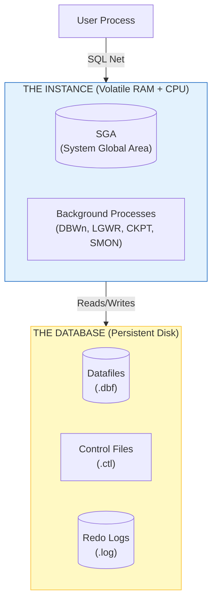
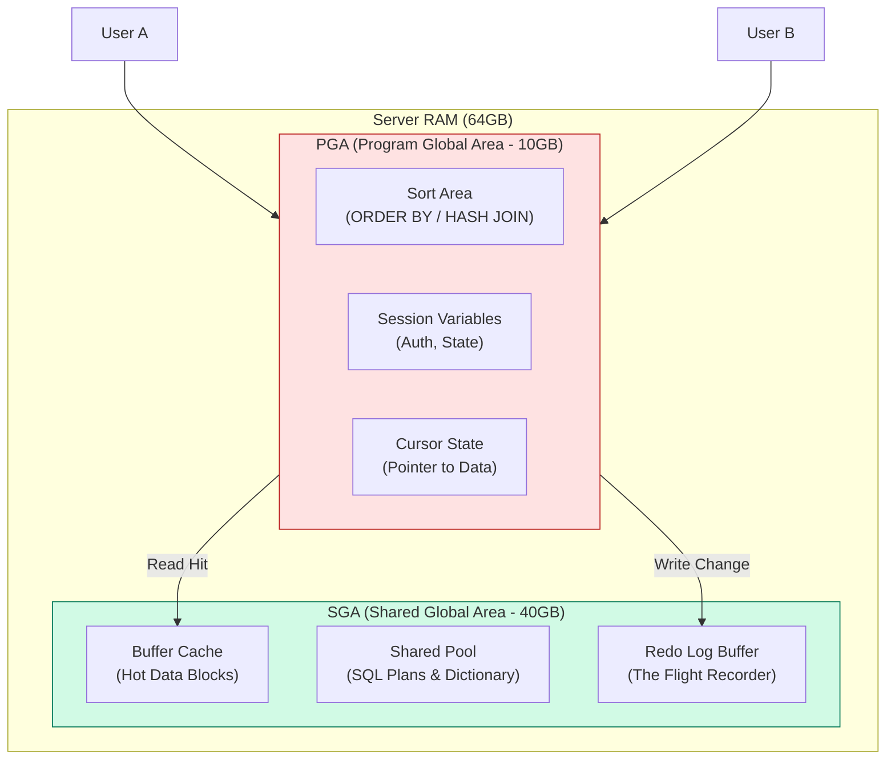
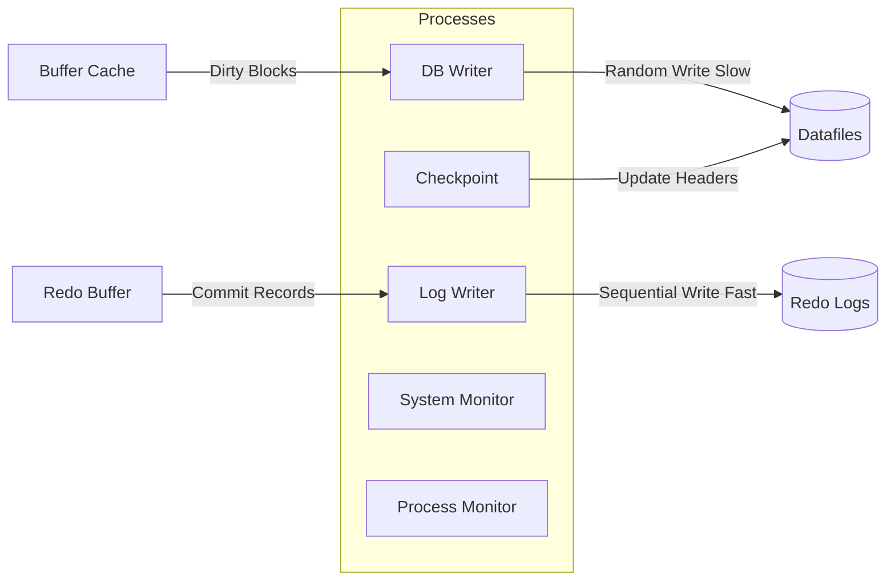
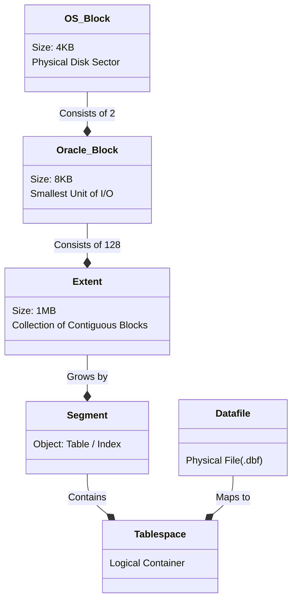

# **DAY 3: ORACLE ARCHITECTURE — THE PHYSICS OF DATABASES**

## **0.0 CONNECTING THE DOTS (THE BRIDGE)**

Before we open the "Black Box" of Oracle, let's ground ourselves in the **OS Physics** we learned in Day 1. Oracle is simply a complex C program that manages these physics manually to guarantee safety and performance.

| **Day 1 Concept (Linux)** | **Day 3 Concept (Oracle)** | **The Physics Connection** |
| --- | --- | --- |
| **The Inode** | **RowID** | Just like an **Inode** is the physical address of a file on disk (Block Location), a **RowID** is the physical address of a row (File # + Block # + Row #). |
| **Page Cache (RAM)** | **SGA (Buffer Cache)** | Linux caches files in RAM to avoid disk I/O. Oracle bypasses this and manages its own cache called the **SGA** to be smarter about eviction policies (LRU). |
| **fsync() / O_SYNC** | **COMMIT** | Remember how `fsync` forced data from RAM to the physical platter? **COMMIT** is just a transaction wrapper that triggers a specific `fsync` call on the Redo Log. |
| **Context Switch** | **Mode Switch** | Oracle architecture is designed to keep work in **User Space (SGA)** to avoid the expensive Ring 0 switches we saw in Day 1. |
| **mmap()** | **Shared Memory (shm)** | The SGA is literally created using the same shared memory system calls (`shmget` / `mmap`) we discussed, allowing multiple processes to access the same RAM. |
## **1.0 THE PHILOSOPHY OF THE "INSTANCE"**

In Data Engineering, a fatal mistake is confusing "The Database" with "The Instance". In the Oracle world (and inherently in Postgres/Snowflake), these are distinct physical entities.

### **1.1 The Definitions**

* **The Instance (The Brain):** This is **Volatile**. It consists of **Shared Memory (SGA)** and **Background Processes**. If you pull the power plug, the Instance vanishes instantly.


* **The Database (The Body):** This is **Persistent**. It consists of physical files on the disk (`.dbf`, `.ctl`, `.log`). If you pull the plug, these remain.




**The Crash Recovery Principle:**
The entire design of a database engine is focused on one problem: **The Gap**.

* **The Gap:** Data is modified in RAM (The Instance) microseconds before it is written to Disk (The Database).
* **The Risk:** If the power fails during that gap, data is lost.
* 
**The Solution:** The **Redo Log** (explained in Section 3.1) bridges this gap.


---

## **2.0 MEMORY ARCHITECTURE (SGA VS PGA)**

Understanding memory management is the difference between a Junior who crashes the server and a Senior who tunes it. Oracle divides memory into **Shared** (Public) and **Private** (Per User) areas.



### **2.1 System Global Area (SGA) — "The Shared Brain"**

The SGA is a massive block of shared memory allocated at startup.

1. **Buffer Cache (The Data Lake in RAM):**
* **Physics:** Reading from RAM takes ~100 nanoseconds. Reading from NVMe Disk takes ~100 microseconds (1000x slower).
* **Mechanism:** When you execute `SELECT *`, Oracle hunts for the block in the Buffer Cache first. If missing (Cache Miss), it reads from disk and places it here.
* **LRU Algorithm:** The cache is finite. Oracle uses a "Least Recently Used" algorithm to evict cold blocks (old data) to make room for hot blocks.


2. **Shared Pool (The Compiler Cache):**
* **The Cost of SQL:** SQL is English. Computers speak Binary. "Parsing" SQL (checking syntax, security, generating execution plans) is CPU-intensive.
* **Mechanism:** Oracle hashes your SQL text. If `SELECT * FROM EMP` has been run before, it finds the **Compiled Plan** in the Shared Pool and skips the hard work.


3. **Redo Log Buffer (The Black Box):**
* **Role:** This circular buffer records every single change (Insert, Update, Delete) made to the database.
* **Criticality:** It is the *only* thing that guarantees durability. We write here *before* we touch the data files.


### **2.2 Program Global Area (PGA) — "The Private Workspace"**

The PGA is private memory exclusive to a single user connection.

1. **Sort Area:**
* Used for operations like `ORDER BY`, `GROUP BY`, and `DISTINCT`.
* **Physics:** Sorting requires comparing variables in RAM. This cannot be shared.


2. **Hash Area:**
* Used for `HASH JOIN` (the workhorse of modern Data Engineering). It builds a hash table of the smaller table in memory.


3. **The Spill (Temp Tablespace):**
* **The Limit:** `PGA_AGGREGATE_LIMIT`. If a user tries to sort 10GB of data but only has 1GB of PGA, Oracle **spills** the sort to the **Temp Tablespace** on disk.
* **Result:** Performance drops by 100x. This is identical to a "Spark Shuffle Spill".


---

## **3.0 PROCESS ARCHITECTURE (THE DAEMONS)**

Oracle doesn't do heavy lifting in the user thread. It delegates to specialized background daemons.



### **3.1 The "Write-Ahead Logging" (WAL) Protocol**

This is the single most important concept in database reliability (used by Oracle, Postgres, Kafka, etc.).

**The Physics Problem:**

* You change 1 row in a 1TB table.
* That row lives in Block #50,402,100.
* To save it, the disk head must physically move (Seek) to that location. **Random I/O is Slow.**

**The WAL Solution:**

1. **LGWR (Log Writer):** When you `COMMIT`, Oracle writes the change vector to the **Redo Log** at the *end* of the file.
* **Physics:** This is **Sequential I/O** (Fast). No seeking required.
* **Guarantee:** Once this sequential write lands, the transaction is durable.


2. **DBWn (Database Writer):** The actual data block (in Buffer Cache) is marked "Dirty" but **NOT** written to the Datafile yet.
* **Lazy Write:** DBWn wakes up later (every 3 seconds or when cache is full) to scatter-write these blocks to the Datafiles.


**Senior Takeaway:** "Commit latency" is determined by **LGWR** speed (Seq I/O). "Throughput" is determined by **DBWn** capability (Random I/O).

---

## **4.0 LOGICAL STORAGE HIERARCHY**

How does a "Table" map to "Physics"?



### **4.1 The Block (The Atom of Data)**

Oracle reads/writes in **8KB Blocks**. Even if you want 1 row (50 bytes), Oracle reads the full 8KB block.

**Anatomy of a Block:**

1. **Header:** Contains the Block Address and **ITL (Interested Transaction List)**. This ITL is where row locking happens.
2. **Table Directory:** Metadata about the table.
3. **Row Directory:** Pointers to the exact byte offset of rows in the block.
4. **Free Space:** The empty space in the middle, waiting for new rows.
5. **Row Data:** The actual data, which grows from the bottom up.


### **4.2 Row Migration & Chaining**

If you `UPDATE` a row and make it bigger (e.g., `VARCHAR(50)` -> `VARCHAR(500)`), it might not fit in the original block's Free Space.

* **Migration:** Oracle moves the *entire* row to a new block and leaves a "Forwarding Address" pointer in the original block.
* **Performance Hit:** Reading that row now requires **2 Physical I/Os** (Read Address -> Jump -> Read Data).


---

## **5.0 THE LANGUAGE OF CONTROL (SQL PHYSICS)**

SQL is not just text; it is a command set for the internal engine.

| Category | Commands | The Physics (What happens inside) |
| --- | --- | --- |
| **DML** (Data Manipulation) | `INSERT`, `UPDATE`, `DELETE`, `MERGE` | **Cheap.** Writes to Redo Log Buffer (RAM). Modifies Buffer Cache (RAM). Does *not* touch disk immediately. |
| **TCL** (Transaction Control) | `COMMIT`, `ROLLBACK` | **Expensive.** `COMMIT` forces LGWR to `fsync` (spin the disk). `ROLLBACK` reads from Undo Segment to restore old data. |
| **DDL** (Data Definition) | `CREATE`, `ALTER`, `DROP`, `TRUNCATE` | **Very Expensive.** 1. Forces a COMMIT (Implicit). 2. Locks the Dictionary. 3. Updates Metadata in `SYSTEM` tablespace. **Never run DDL in a loop.** |
| **DCL** (Data Control) | `GRANT`, `REVOKE` | **Security.** Updates the `sys.user$` tables. Checked during the "Parse" phase of every query. |

---

## **6.0 ADVANCED OBJECTS & METADATA**

### **6.1 Indexes (The B-Tree)**

An index is a sorted copy of your data (Key + RowID) organized in a Tree structure.

* **Physics:** Instead of scanning 1,000,000 blocks (Full Table Scan), Oracle traverses the tree (Root -> Branch -> Leaf) in ~3-4 I/Os to find the RowID.
* **Cost:** Every `INSERT` to the table requires an `INSERT` to the Index. Too many indexes slow down write speed.


### **6.2 Triggers (The Silent Killers)**

* **Definition:** Logic that fires *automatically* on DML events.
* **Physics:** Triggers execute **row-by-row**. If you update 1,000,000 rows, the trigger fires 1,000,000 times. This creates a massive "Context Switch" overhead between the SQL Engine and the PL/SQL Engine.
* **Senior Advice:** Avoid triggers for bulk data. Use ETL pipelines instead.


### **6.3 The Data Dictionary (Metadata)**

In Postgres, you use `information_schema` or `pg_catalog`. In Oracle, we query the **Dictionary Views**.

| Postgres / Generic | Oracle View | What it contains |
| --- | --- | --- |
| `information_schema.tables` | `DBA_TABLES` / `ALL_TABLES` | Table names, row counts, storage parameters. |
| `information_schema.columns` | `DBA_TAB_COLUMNS` | Column names, data types. |
| `pg_indexes` | `DBA_INDEXES` | Index definitions and status. |
| `pg_stat_activity` | `V$SESSION` | Who is logged in and what SQL they are running. |
| `pg_settings` | `V$PARAMETER` | System configuration (SGA Size, etc.). |

---

## **7.0 CONCURRENCY (MVCC & ACID)**

How does Oracle allow User A to **Read** a table while User B is **Updating** it? Most systems lock the table. Oracle uses **Multi-Version Concurrency Control (MVCC)**.

### **7.1 The Undo Segment (Time Travel)**

When you update a row, Oracle does *not* overwrite the old data immediately.

1. It copies the *Old Value* (Before Image) to an **Undo Segment**.
2. It writes the *New Value* to the Data Block.
3. It updates the block header to point to the Undo Segment.


### **7.2 Consistent Read**

1. **User A** starts `SELECT * FROM EMP` at **SCN 100**.
2. **User B** updates `EMP` sets `SALARY = 0` and Commits at **SCN 110**.
3. **User A** reaches the row. It sees the block has SCN 110.
4. **The Magic:** Oracle sees `110 > 100`. The block is "too new."
5. **Reconstruction:** Oracle follows the pointer to the **Undo Segment**, finds the *old value* (from SCN 100), and serves *that* to User A.

**Result:** Readers **never** block Writers. Writers **never** block Readers.

---

## **8.0 INTERACTIVE LAB: THE PHYSICS SIMULATION**

*Note: Copy these python blocks into a file named `oracle_sim.py` or run them in your Jupyter Notebook to prove the physics.*

### **Lab 1: The SGA Simulator (Shared vs Private Memory)**

This script proves that "Private" variables (PGA) are isolated, while "Shared" variables (SGA) are visible to everyone.

```python
import multiprocessing
import time
import random

def db_user(user_id, sga_counter, lock):
    """Simulates a User Process connecting to Oracle"""
    # PGA (Private Memory): Only this function sees it
    pga_variable = random.randint(1, 100)
    
    # SGA (Shared Memory): All processes see/modify this
    with lock: # Oracle uses 'Latches' (Locks) to protect SGA
        current_val = sga_counter.value
        time.sleep(0.01) # Simulate CPU work
        sga_counter.value = current_val + 1
        
    print(f"[User {user_id}] PGA={pga_variable}, SGA_Counter={sga_counter.value}")

if __name__ == "__main__":
    print("--- Starting Instance Simulation ---")
    
    # 1. Allocate SGA (Shared Value)
    sga_counter = multiprocessing.Value('i', 0)
    sga_lock = multiprocessing.Lock()

    # 2. Spawn 5 User Processes
    processes = []
    for i in range(5):
        p = multiprocessing.Process(target=db_user, args=(i, sga_counter, sga_lock))
        processes.append(p)
        p.start()

    for p in processes:
        p.join()
        
    print(f"--- Final SGA Value: {sga_counter.value} (Should be 5) ---")

```

### **Lab 2: The WAL Benchmark (Why Redo Logs exist)**

This script races **Sequential I/O** (Redo Log) against **Random I/O** (Datafile) to prove why we need the log.

```python
import os
import time
import random

FILE_SIZE_MB = 10
CHUNK_SIZE = 1024 # 1KB records
NUM_WRITES = 5000

redo_file = "redo_log.log"
data_file = "datafile.dbf"

# Pre-allocate the data file (Simulating a real DB file)
with open(data_file, "wb") as f:
    f.write(b'\0' * (FILE_SIZE_MB * 1024 * 1024))

print(f"--- Racing {NUM_WRITES} writes ---")

# 1. Sequential Write (LGWR simulation)
start = time.time()
with open(redo_file, "wb") as f:
    for i in range(NUM_WRITES):
        f.write(os.urandom(CHUNK_SIZE)) # Always appending at the end
print(f"Sequential (Redo Log): {time.time() - start:.4f} seconds")

# 2. Random Write (DBWn simulation)
start = time.time()
with open(data_file, "r+b") as f:
    for i in range(NUM_WRITES):
        # Seek to a random location in the file
        random_pos = random.randint(0, FILE_SIZE_MB * 1024 * 1024 - CHUNK_SIZE)
        f.seek(random_pos)
        f.write(os.urandom(CHUNK_SIZE))
print(f"Random (Datafile):     {time.time() - start:.4f} seconds")

# Result: Sequential is usually 10x-50x faster!
if os.path.exists(redo_file): os.remove(redo_file)
if os.path.exists(data_file): os.remove(data_file)

```

### **Lab 3: The MVCC Class (Time Travel)**

A simple implementation of Multi-Version Concurrency Control to show how "Undo" works.

```python
class OracleRow:
    def __init__(self, data, scn):
        self.data = data
        self.scn = scn  # System Change Number (Timestamp)
        self.undo_segment = [] # History of changes

    def update(self, new_data, new_scn):
        # 1. Save current state to Undo
        self.undo_segment.append((self.scn, self.data))
        # 2. Update current state
        self.data = new_data
        self.scn = new_scn

    def read_consistent(self, query_scn):
        """Reconstruct the row as it looked at query_scn"""
        # If current row is old enough, return it
        if self.scn <= query_scn:
            return self.data
        
        # Otherwise, go back in time (Undo)
        # print(f"   [MVCC] Row SCN {self.scn} is too new. Checking Undo...")
        for old_scn, old_data in reversed(self.undo_segment):
            if old_scn <= query_scn:
                return old_data
        return None # Row didn't exist then

# --- The Simulation ---
row = OracleRow(data="Salary=1000", scn=100)

# 1. User A starts a long query at SCN 105
query_scn_A = 105
print(f"User A sees (Time 105): {row.read_consistent(query_scn_A)}")

# 2. User B updates the row at SCN 110
row.update(new_data="Salary=2000", new_scn=110)
print("User B committed Update to 2000 (Time 110).")

# 3. User A reads AGAIN (Should still see 1000, not 2000)
print(f"User A sees (Time 105): {row.read_consistent(query_scn_A)}")

```

---

## **9.0 SUMMARY**

1. **Instance != Database:** RAM dies, Disk survives.
2. **WAL (Write Ahead Log):** We write to the log (fast) before the data file (slow).
3. **SGA vs PGA:** Shared cache vs Private work area.
4. **I/O Units:** We read Blocks (8KB), not rows.
5. **MVCC:** Readers don't block writers; they just read the "Undo" history.
6. **DDL is Expensive:** It forces internal commits and locks.
7. **Triggers are Dangerous:** They kill bulk performance by processing row-by-row.

### **Next Steps**

Now that we understand the Memory and Process architecture, **Day 4** will take us down to the **Physical Storage Layer**. We will analyze Heap Tables, B-Trees, and exactly how bytes are arranged on the magnetic platter.
